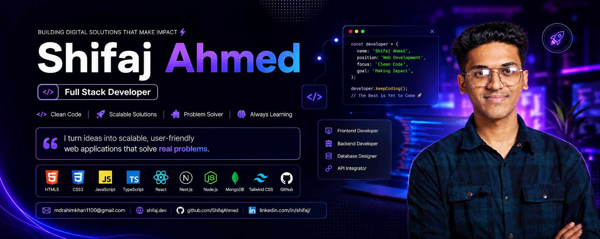

<!--- banner --->

 

<!--- title --->

  <ul align="center">
    
<h1 style="display: inline-block">Hi 👋, I'm SHIFAJ AHMED RAHIM</h1>

    <!--- typo --->
    
  </ul>

 

<!--- about --->
- 👋 Hi, I’m **[@shifajahmed](https://github.com/shifajahmed)**
- 🖥️ I’m currently working on **React.js, Next.js and Typescript** for frontend development.
- 🗄️ Using **Node.js, Express.js, MongoDB, Mongoose and PostgreSQL** for the backend.
- 🛠️ I’m currently learning **React Native, GraphQL, Docker and AWS**.
- 💬 Ask me about **Full-Stack (React, Next, Node, Express, MongoDB, PostgreSQL)**.
- 🌐 Explore My Projects on **[GitHub](https://github.com/shifajahmed)**
- 📝 I regularly write articles on **[LinkedIn](https://linkedin.com/in/shifaj)**
- 📫 Feel free to reach me out **[Email](mdrahimkhan1100@gmail.com)**
  
 

<!--- socials --->
## <b> FOLLOW ME ON SOCIALS:</b>

  

    
    
    
    
  

 

<!--- technology --->
##  <b> TECHNOLOGY STACK:</b>

### Languages:

### CSS Frameworks & Libraries:

### JavaScript Frameworks & Libraries:

### Database & Model:

### Deployment Platform:

### Design & Graphics:

### Tools & Technologies:

 

<!--- statistics --->
## <b> GITHUB STATISTICS & ANALYSIS:</b>

### GitHub Contributions:
[Snake Grid](https://github.com/shifajahmed/contribution-snake/blob/output/grid.svg)
